<!-- Hero: Monochrome ASCII Portrait (Types in) + Handwritten ASCII Signature -->
<h3><code>vinicius@github ~ $ whoami</code></h3>

<table>
  <tr>
    <td valign="top" align="center">
      
    </td>
    <td valign="top" align="center">
      
    </td>
  </tr>
</table>

 
 

<!-- Animated Contribution Graph: auto-refreshed daily by GitHub Actions -->
<h3><code>vinicius@github ~ $ ./contributions.sh</code></h3>

 
 

<!-- Links & Social Badges -->
<h3><code>vinicius@github ~ $ ./links.sh</code></h3>

<b>Tech Support Analyst @ Hansen Software · Computer Science Student · Systems & Automation Builder</b>

  
  &nbsp;
  
  &nbsp;
  

 
 

<!-- Neofetch System Info -->
<h3><code>vinicius@github ~ $ neofetch</code></h3>

 
 

<!-- Featured Projects -->
<h3><code>vinicius@github ~ $ ./featured_projects.sh</code></h3>

<table>
  <tr>
    <td width="50%" valign="top">
      <h4><a href="https://github.com/ViniciusNoetzold/MezzoldConnect">⚡ Mezzold Connect</a></h4>
      
Aplicação desktop e serviço local para gestão de contatos, campanhas, consentimento, filas assíncronas e monitoramento de saúde de números.

      
<code>Python</code> <code>TypeScript</code> <code>Fastify</code> <code>PostgreSQL</code> <code>Redis</code> <code>BullMQ</code>

    </td>
    <td width="50%" valign="top">
      <h4><a href="https://github.com/ViniciusNoetzold/YoutubeTrendVideosFounder">🚀 YouTube Trend & Content Founder</a></h4>
      
Caçador de tendências, extrator de palavras-chave, curador de referências e gerador de roteiros com IA da NVIDIA (NVIDIA NIM) para o YouTube.

      
<code>Python</code> <code>NVIDIA NIM IA</code> <code>YouTube Data API</code> <code>Analytics</code>

    </td>
  </tr>
  <tr>
    <td width="50%" valign="top">
      <h4><a href="https://github.com/ViniciusNoetzold/QuotePRO_Or-amentos">💼 QuotePRO Orçamentos</a></h4>
      
Software desktop para emissão e cálculo inteligente de orçamentos, controle de compras, fluxo financeiro, relatórios e geração de PDFs.

      
<code>React</code> <code>TypeScript</code> <code>Electron</code> <code>Bun</code> <code>SQLite</code> <code>TailwindCSS</code>

    </td>
    <td width="50%" valign="top">
      <h4><a href="https://github.com/ViniciusNoetzold/EduSystem">🎓 EduSystem</a></h4>
      
Plataforma desktop de gestão educacional completa com UI glassmorphism, controle de turmas/alunos, chamadas, relatórios e quadro interativo.

      
<code>React</code> <code>Vite</code> <code>Node.js / Express</code> <code>Electron</code> <code>SQLite</code>

    </td>
  </tr>
</table>

 
 

<!-- Mezzold Studios ASCII Branding -->
<h3><code>vinicius@github ~ $ ./mezzold_studios.sh</code></h3>

 

