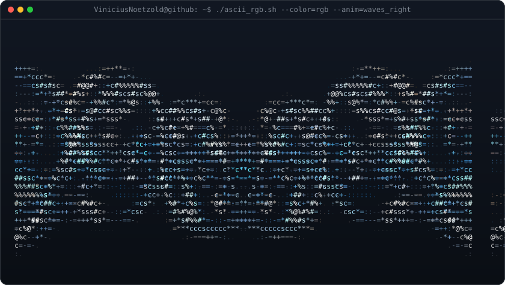
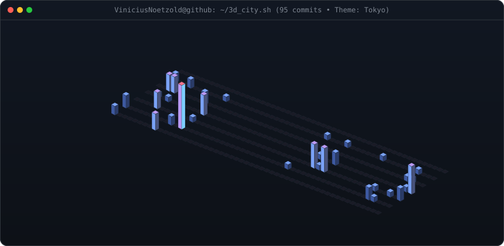
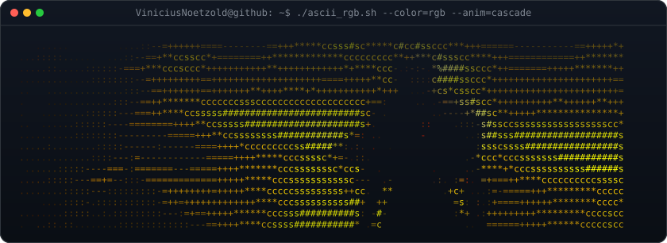
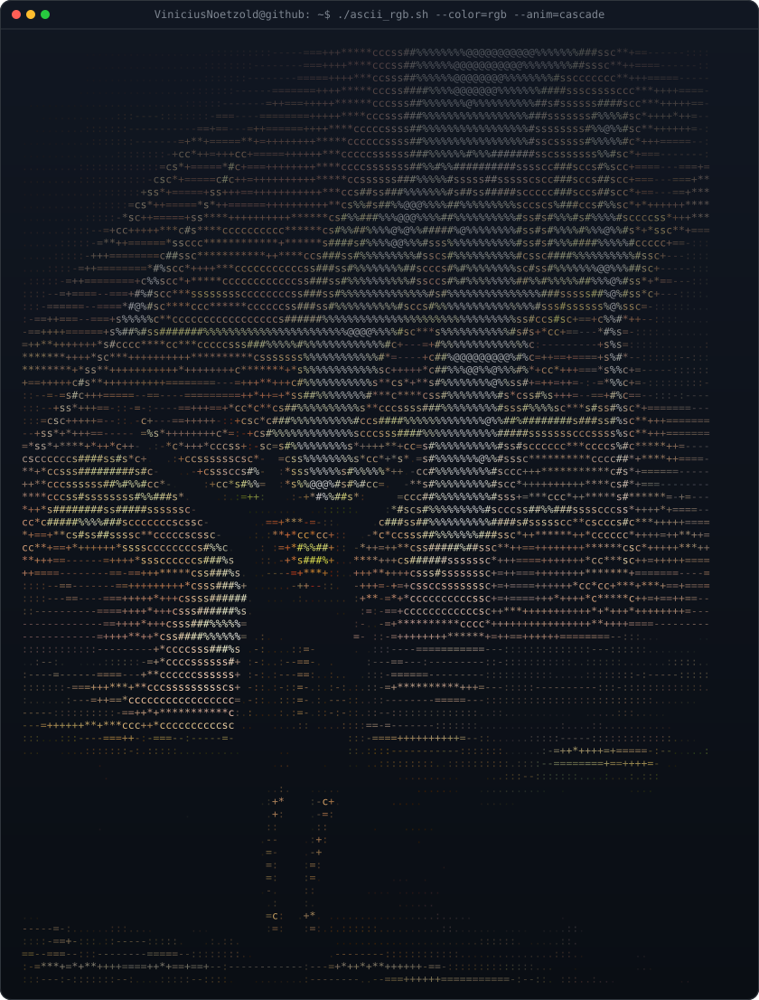
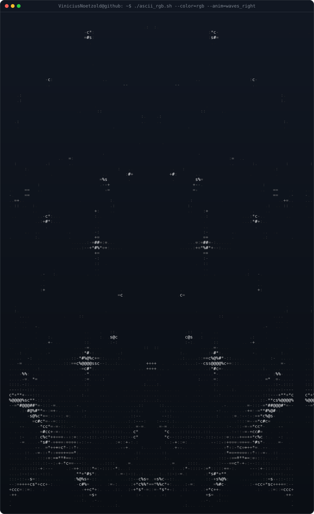

<!-- ================================================================= -->
<!-- HERO: IDENTITY & SLANT BANNER                                     -->
<!-- ================================================================= -->
<h3><code>vinicius@github ~ $ ./boot_system.sh --identity=cyberpunk</code></h3>

<table>
  <tr>
    <td width="50%" align="center" valign="middle">
      
    </td>
    <td width="50%" align="center" valign="middle">
      
    </td>
  </tr>
</table>

  <b>Tech Support Analyst @ Hansen Software · Computer Science Student · Systems & Automation Architect</b>

<!-- Social Badges & Status -->

  
  &nbsp;
  
  &nbsp;
  

 

<!-- ================================================================= -->
<!-- FLUID WAVE CONVEYOR: SEAMLESS AUDIO/LIQUID STREAM                  -->
<!-- ================================================================= -->
<h3><code>vinicius@github ~ $ ./stream_monitor.sh --stream=liquid-metal --anim=waves</code></h3>

  

 
 

<!-- ================================================================= -->
<!-- TELEMETRY & 3D ISOMETRIC COMMIT CITY                              -->
<!-- ================================================================= -->
<h3><code>vinicius@github ~ $ ./city_skyline.sh --isometric-3d --palettes=cyberpunk</code></h3>

  

  

 
 

<!-- ================================================================= -->
<!-- FEATURED PROJECTS                                                 -->
<!-- ================================================================= -->
<h3><code>vinicius@github ~ $ ./featured_projects.sh</code></h3>

<table>
  <tr>
    <td width="50%" valign="top">
      <h4><a href="https://github.com/ViniciusNoetzold/YoutubeTrendVideosFounder">🚀 YouTube Trend & Content Founder</a></h4>
      
Curadoria e caça inteligente de tendências com IA (NVIDIA NIM), extração de keywords em tempo real e orquestração de scripts para criadores.

      
<code>Python</code> <code>NVIDIA NIM AI</code> <code>YouTube API</code> <code>Data Mining</code>

    </td>
    <td width="50%" valign="top">
      <h4><a href="https://github.com/ViniciusNoetzold/QuotePRO_Or-amentos">💼 QuotePRO Orçamentos</a></h4>
      
Software desktop para cálculo inteligente de orçamentos, emissão rápida de ordens de serviço, controle financeiro e exportação de PDFs de alta definição.

      
<code>React</code> <code>TypeScript</code> <code>Electron</code> <code>Bun</code> <code>SQLite</code> <code>TailwindCSS</code>

    </td>
  </tr>
  <tr>
    <td width="50%" valign="top">
      <h4><a href="https://github.com/ViniciusNoetzold/Rest-Api-Spring-Booot">⚡ Spring Boot REST API</a></h4>
      
API RESTful robusta em Java e Spring Boot com arquitetura em camadas, validação de requisições, controllers e testes unitários com JUnit e Maven.

      
<code>Java</code> <code>Spring Boot</code> <code>REST API</code> <code>Maven</code> <code>JUnit</code>

    </td>
    <td width="50%" valign="top">
      <h4><a href="https://github.com/ViniciusNoetzold/MarketSystemPOO">🐍 MarketSystem POO</a></h4>
      
Sistema de gestão comercial em Python aplicando programação orientada a objetos (POO), controle de estoque, vendas e persistência CSV.

      
<code>Python</code> <code>POO</code> <code>Data Structures</code> <code>CSV</code> <code>CLI</code>

    </td>
  </tr>
</table>

 
 

<!-- ================================================================= -->
<!-- ARTISTIC SANCTUARY: CREATION OF ADAM & PRAISE THE SUN             -->
<!-- ================================================================= -->
<h3><code>vinicius@github ~ $ ./gallery.sh --sanctuary --easter-eggs</code></h3>

<table>
  <tr>
    <td width="50%" align="center" valign="top">
      
<b>🔥 Bonfire Lit · Dark Souls Shrine</b>

      
    </td>
    <td width="50%" align="center" valign="top">
      
<b>\[T]/ Solaire of Astora · Praise the Sun</b>

      
    </td>
  </tr>
  <tr>
    <td width="50%" align="center" valign="top">
      
<b>☀️ The Sun Sigil · Warrior of Sunlight</b>

      
    </td>
    <td width="50%" align="center" valign="top">
      
<b>🤝 The Creation of Adam · Hands ASCII TrueColor</b>

      
    </td>
  </tr>
</table>

<!-- Deep Art Expansion (Expandable) -->

  
<b>✨ [ Clique para Expandir o Acervo Completo em Alta Definição (Dark Souls III, Solaire Big & Cosmos) ]</b>

   
  

    <b>⚔️ Dark Souls III Epic Banner</b> 
    
  

   
  

    <b>☀️ Solaire of Astora — Full Scale Knight</b> 
    
  

   
  

    <b>🌌 Constelação & Cosmos ASCII</b> 
    
  

 
 

<!-- ================================================================= -->
<!-- SYSTEM SPECS & FOOTER                                             -->
<!-- ================================================================= -->
<h3><code>vinicius@github ~ $ neofetch</code></h3>

 
 

  Built with passion & terminal artistry using <a href="https://mezzoldstudio.com.br/"><b>Mezzold Studios</b></a> · © 2026 Vinícius Noetzold

