<!-- Hero: Monochrome ASCII Portrait (Types in) + 3D ASCII Wordmark (Rocks in 3D) -->
<h3><code>vinicius@github ~ $ whoami</code></h3>

<table>
  <tr>
    <td valign="top" align="center">
      
    </td>
    <td valign="top" align="center">
      
    </td>
  </tr>
</table>

 
 

<!-- Animated Contribution Graph: auto-refreshed daily by GitHub Actions -->
<h3><code>vinicius@github ~ $ ./contributions.sh</code></h3>

 
 

<!-- Links & Social Badges -->
<h3><code>vinicius@github ~ $ ./links.sh</code></h3>

<b>Tech Support Analyst @ Hansen Software · Computer Science Student · Systems & Automation Builder</b>

  
  &nbsp;
  
  &nbsp;
  

 
 

<!-- Neofetch System Info -->
<h3><code>vinicius@github ~ $ neofetch</code></h3>

 
 

<!-- Featured Projects -->
<h3><code>vinicius@github ~ $ ./featured_projects.sh</code></h3>

<table>
  <tr>
    <td width="33%" valign="top">
      <h4><a href="https://github.com/ViniciusNoetzold/MezzoldConnect">📦 Mezzold Connect</a></h4>
      
Aplicação desktop e serviço local para gestão de contatos, campanhas, consentimento, histórico, filas e monitoramento de saúde de números.

      
<code>Python</code> <code>Tkinter</code> <code>TypeScript</code> <code>Fastify</code> <code>PostgreSQL</code> <code>Redis</code> <code>BullMQ</code>

    </td>
    <td width="33%" valign="top">
      <h4><a href="https://github.com/ViniciusNoetzold/MarketSystemPOO">🛒 Market System POO</a></h4>
      
Sistema de mercado em terminal, cadastro de clientes e produtos, controle de estoque, vendas, persistência CSV e undo com pilha e fila.

      
<code>Python</code> <code>POO</code> <code>Estruturas de Dados</code> <code>CSV</code>

    </td>
    <td width="33%" valign="top">
      <h4><a href="https://github.com/ViniciusNoetzold/Rest-Api-Spring-Booot">☕ API com Spring Boot</a></h4>
      
API REST acadêmica em Java para aplicação de controllers, parâmetros de rota e consulta, injeção de dependências e testes.

      
<code>Java</code> <code>Spring Boot</code> <code>Maven</code> <code>JUnit</code>

    </td>
  </tr>
</table>

 

